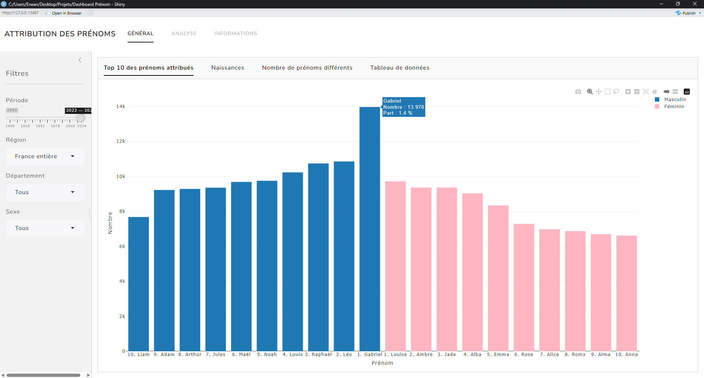
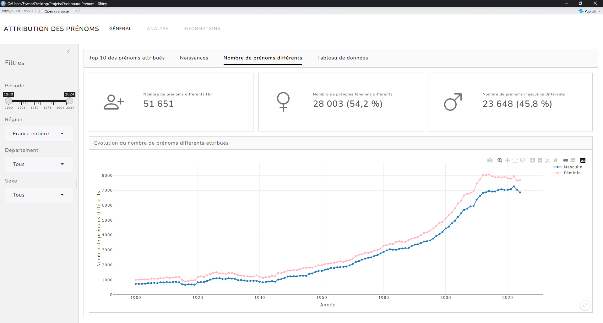
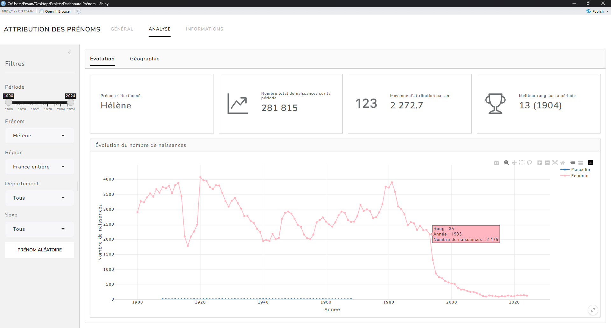
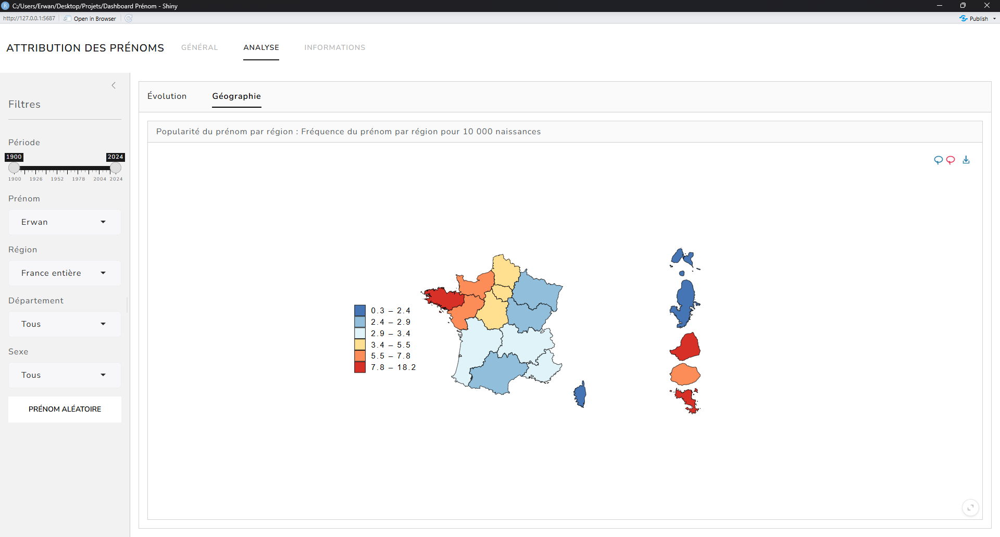

# Attribution des Prénoms

Application interactive développée avec R Shiny permettant d’explorer l’évolution 
des prénoms attribués en France depuis 1900.


L’application propose des visualisations interactives, des indicateurs statistiques 
et des analyses géographiques à partir des données ouvertes de l’Insee.

### Aperçu

L’application permet notamment de :

- explorer les prénoms les plus attribués ;
- analyser l’évolution d’un prénom dans le temps ;
- filtrer les données par période, région, département et sexe ;
- visualiser la popularité géographique d’un prénom ;

### Exemples

Entre 2022 et 2024, Gabriel a été le prénom masculin le plus attribué en France, 
avec près de 14 000 naissances, soit environ 1,4 % des garçons nés sur cette période.



<br>
Avant les années 1960–1970, le nombre de prénoms différents attribués chaque année restait 
relativement stable. À partir des années 1970, une hausse progressive s’observe, traduisant 
une diversification croissante des choix de prénoms. Cette augmentation s’accélère fortement 
au début des années 1990, en lien notamment avec la loi de 1993 qui assouplit les règles 
relatives au choix des prénoms.



<br>
L’évolution de la popularité du prénom Hélène en France sur la période 1900–2024 
montre une première phase de stabilité. Le nombre d’attributions reste globalement 
constant durant la majeure partie du XXᵉ siècle, avec une moyenne légèrement inférieure 
à 3 000 naissances par an entre 1900 et 1990.

À partir du début des années 1990, une rupture nette est observée. La popularité 
du prénom chute fortement, avec une moyenne d’environ 385 attributions par an entre 1993 et 2024.
Cette baisse coïncide avec la diffusion de la série "Hélène et les garçons" à partir de 1993.



<br>
Parmi l’ensemble des prénoms attribués dans chaque région, le prénom Erwan est 
particulièrement populaire en Bretagne, région d’origine de ce prénom. 
Il est également bien représenté dans les régions limitrophes, notamment la 
Normandie et les Pays de la Loire.

Il convient toutefois de noter que les données régionales sont moins exhaustives 
que les données nationales, en particulier pour certains territoires d’outre-mer.

L’indicateur retenu repose sur la part du prénom au sein de chaque région plutôt 
que sur sa contribution au total national. Ce choix permet d’éviter de favoriser 
mécaniquement les régions les plus peuplées, qui ont davantage de naissances et 
donc plus de chances de dominer en valeur absolue, indépendamment de la popularité 
réelle du prénom.

{ width=100% }


### Fonctionnalités

Le dashboard est composé de 3 onglets principaux :

#### Général

- Top 10 des prénoms attribués
- Évolution du nombre de prénoms attribués (naissances)
- Évolution du nombre de prénoms différents attribués
- Tableau interactif des données
- Filtres dynamiques

#### Analyse

Module d'analyse pour le prénom spécifique sélectionné (plus de 48 000 prénoms différents)

- Recherche d’un prénom spécifique
- Évolution annuelle du nombre d'attributions du prénom 
- Indicateurs clés :
    - nombre total de naissances ;
    - moyenne annuelle ;
    - meilleur rang ;
    
- Carte de popularité régionale du prénom
- Option de sélection aléatoire d’un prénom

#### Informations

- Documentation sur les données Insee
- Méthodologie de traitement
- Limites et qualité des données
- Informations sur la diffusion statistique

### Structure du projet

```
.
├── data/
|   ├── raw/
|   └── data_management.R
├── www/
├── R/
|   ├── cartographie.R
|   └── functions.R 
├── global.R
├── ui.R
├── server.R
└── README.md
```

### Framework

- Visualisation : `plotly`, `ggplot2`, `DT`
- Manipulation de données : `dplyr`
- Dashboard : `shiny`, `bslib`

### Source des données

Les données proviennent de l’Insee :

- Fichier des prénoms attribués depuis 1900 (issues des bulletins d'état civil de naissance)
- Elles couvrent la période 1900 - 2024.
- Découpage par département, région et France entière

Source officielle : https://www.insee.fr/fr/statistiques/8595130

### Installation

1. Cloner le projet

```
git clone https://github.com/Erwan-Maraud/Dashboard-Prenom.git
cd votre-repo
```

2. Installer les dépendances

```
install.packages(c(
  "shiny",
  "bslib",
  "plotly",
  "ggplot2",
  "ggiraph",
  "dplyr",
  "tidyr",
  "stringr",
  "purrr",
  "DT",
  "bsicons"
))
```

3. Préparer les données 

Les données téléchargeables dans le dépot git sont les données bruts provennant de l'INSEE, pour 
l'execution de l'application, il est nécessaire d'executer le script `data_management.R`. Cette étape 
est à faire qu'une seule fois.

```
source("data/data_management.R")
```

4. Lancer l'application 

```
shiny::runApp()
```

